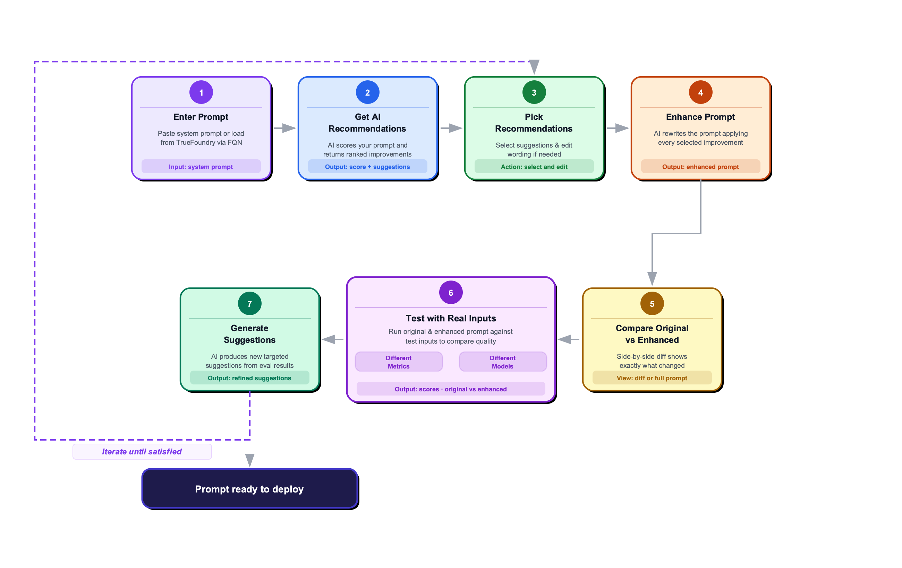
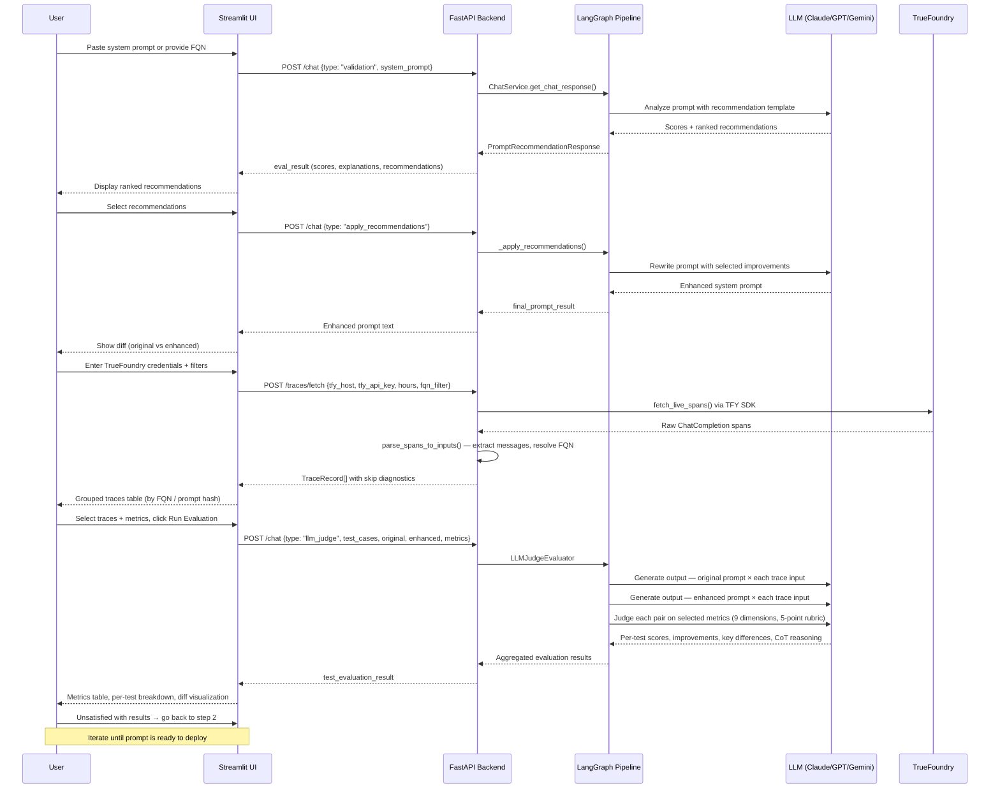

# Prompt Tuner

An end-to-end LLM prompt evaluation and optimization platform. It combines a **FastAPI backend** with a **Streamlit frontend** to help developers analyze, improve, and validate prompts using both synthetic test cases and real production traces.

---

## Workflow



The platform follows a 7-step iterative loop:

1. **Enter Prompt** — Paste a system prompt or load one from TrueFoundry via FQN
2. **Get AI Recommendations** — Analyzes the prompt and returns ranked improvement suggestions
3. **Pick Recommendations** — Select suggestions and optionally edit wording
4. **Enhance Prompt** — AI rewrites the prompt applying every selected improvement
5. **Compare Original vs Enhanced** — Side-by-side diff shows exactly what changed
6. **Test with Real Inputs** — Run both prompts against test inputs using LLM Judge or DeepEval metrics
7. **Generate Suggestions** — AI produces new targeted suggestions from eval results; iterate until satisfied

---

## Sequence Diagram



---

## Features

- **AI-powered recommendations** — Analyzes prompts across clarity, completeness, accuracy, conciseness, and tone
- **Prompt enhancement** — Automatically rewrites prompts applying selected improvements
- **LLM-as-Judge evaluation** — 9 configurable metrics with detailed 5-point rubrics and chain-of-thought reasoning
- **DeepEval integration** — GEval (Correctness), Toxicity, Bias, Contextual Precision metrics
- **Exact-match testing** — Deterministic pass/fail test cases
- **TrueFoundry trace integration** — Load real production spans and evaluate against them
- **Multi-model support** — Claude (Anthropic), GPT-4 (OpenAI), Gemini (Google), custom TFY-hosted models
- **Side-by-side diff** — Visual diff of original vs enhanced prompt with cost & latency comparison

---

## Architecture

```
prompt-validator/
├── src/                          # FastAPI backend
│   └── chat/
│       ├── controller/           # API endpoints (chat, traces)
│       ├── service/              # ChatService — orchestration entry point
│       ├── graph/                # LangGraph pipeline + evaluators
│       │   ├── primary_graph.py  # State graph: fetch → route → evaluate
│       │   ├── llm_judge_evaluator.py
│       │   ├── deepeval_evaluator.py
│       │   └── exact_match_evaluator.py
│       ├── models/               # Pydantic request/response models
│       └── utils/                # LLM clients, constants
│
├── ui/                           # Streamlit frontend
│   ├── app.py                    # Entry point — 5-tab layout
│   ├── tabs/
│   │   ├── recommendations.py    # Tab 1: Get improvement suggestions
│   │   ├── enhance.py            # Tab 2: Apply & compare prompts
│   │   ├── test_eval.py          # Tab 3: DeepEval test cases
│   │   ├── exact_match.py        # Tab 4: Exact-match test cases
│   │   └── trace_eval.py         # Tab 5: Production trace evaluation
│   ├── actions/                  # Action handlers
│   └── api_client.py             # HTTP client with retry/backoff
│
├── trace/
│   └── trace_parser.py           # TrueFoundry span fetching & parsing
│
├── prompts/                      # System prompts for LLM operations
├── config/                       # App configuration
└── artifacts/                    # Workflow diagrams
```

### Key Data Flow

| Request Type | Triggered By | Pipeline |
|---|---|---|
| `validation` | Recommendations tab | Analyze prompt → return scores + suggestions |
| `apply_recommendations` | Enhance tab | Rewrite prompt applying selected improvements |
| `llm_judge` | Trace Eval / Enhance tab | Judge original vs enhanced on N metrics |
| `deepeval_prompt_metrics` | DeepEval tab | Run DeepEval metric suite |
| `verify_tests` | Test Eval tab | Run test cases with DeepEval |
| `exact_match` | Exact Match tab | Deterministic pass/fail tests |

---

## Prerequisites

- Python 3.12+
- [uv](https://docs.astral.sh/uv/) — fast Python package manager
- TrueFoundry account (optional — for production trace integration)
- LLM API keys: Anthropic / OpenAI / Google

---

## Getting Started

### 1. Set up environment

```bash
uv venv
source .venv/bin/activate        # macOS/Linux
# .venv\Scripts\activate         # Windows

uv pip install -r requirements.txt
```

### 2. Configure environment variables

```bash
cp .env-sample .env
# Edit .env with your API keys and TrueFoundry credentials
```

### 3. Start the backend

```bash
uvicorn src.chat.controller.chat_controller:app --host 0.0.0.0 --port 21120
```

Backend available at:
- API: `http://127.0.0.1:21120`
- Swagger UI: `http://127.0.0.1:21120/docs`

### 4. Start the frontend

```bash
streamlit run ui/app.py
```

UI available at: `http://localhost:8501`

---

## Docker

```bash
docker build -t prompt-tuner .
docker-compose up
```

---

## Evaluation Metrics

### LLM Judge (9 metrics)

| Group | Metric | Description |
|---|---|---|
| General Quality | `clarity` | How clear and unambiguous the prompt is |
| General Quality | `completeness` | Whether all necessary context is included |
| General Quality | `accuracy` | Factual correctness of instructions |
| General Quality | `conciseness` | No unnecessary verbosity |
| General Quality | `professional_tone` | Appropriate tone for the use case |
| Guardrails | `output_format_compliance` | Output matches specified format |
| Guardrails | `hallucination_avoidance` | Reduces model hallucination |
| Conversational | `answer_relevance` | Response stays on topic |
| Conversational | `prompt_instruction_adherence` | Model follows given instructions |

All metrics use a **5-point rubric** with detailed anchors and return per-test scores, key differences, improvement classification (✅ better / 🟰 same / ❌ worse), and chain-of-thought reasoning.

### DeepEval Metrics

- **GEval (Correctness)** — LLM-graded semantic correctness
- **ToxicityMetric** — Detects harmful content
- **BiasMetric** — Detects unfair bias
- **ContextualPrecisionMetric** — Relevance of retrieved context

---

## Trace Integration (TrueFoundry)

The platform connects to TrueFoundry to pull live production spans:

1. Filter by time range, FQN, user email, span type
2. **3-tier FQN resolution**: span attribute → embedded in `tfy.input` JSON → auto-hash system prompt
3. Group traces by prompt version for structured evaluation
4. Evaluate production inputs against enhanced prompts before deploying

---

## API Reference

### `POST /chat`

Runs the prompt evaluation/enhancement pipeline.

**Request body**: `PromptRecommendationRequest`

```json
{
  "session_id": "abc123",
  "type": "llm_judge",
  "system_prompt": "You are a helpful assistant...",
  "enhanced_system_prompt": "You are a precise, concise assistant...",
  "test_cases": [{"input": "...", "expected_output": "..."}],
  "judge_metrics": ["clarity", "answer_relevance"],
  "model_name": "claude-sonnet-4-6",
  "temperature": 0.0
}
```

### `POST /traces/fetch`

Fetches and parses live spans from TrueFoundry.

```json
{
  "tfy_host": "https://your-org.truefoundry.com",
  "tfy_api_key": "...",
  "hours": 24,
  "limit": 100,
  "fqn_filter": "my-project/my-prompt:v1"
}
```

---

## License

Proprietary and confidential. All rights reserved.
